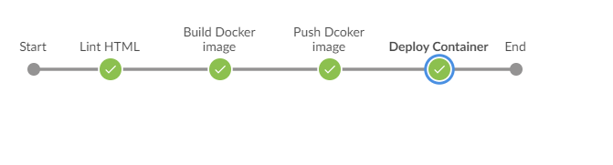

# Udacity AWS Cloud DevOps Nanodegree

## Project Overview

 In this project, I applied the skills and knowledge which was developed throughout the Cloud DevOps Nanodegree program. These include:

1)	Working in AWS
2)	Using Jenkins to implement Continuous Integration and Continuous Deployment 
3)	Building pipelines 
4)	Working with Ansible and CloudFormation to deployclusters 
5)	Building Kubernetes clusters 
6)	Building Docker containers in pipelines 

I developed a CI/CD pipeline for microservices applications with rolling deployment. I developed Continuous Integration steps such as linting. I also developed Contiguous Deployment like pushing the built Docker containers to the Docker repository. Deploying these Docker containers to a small Kubernetes cluster. I used eksctl to create the Kubernetes cluster .i used the Jenkins pipline to deploy my Kubernetes cluster using Cloudformation.



## Docker & Kubernetes locally
The docker app could be tested locally:

`$ ./run_docker.sh` and go to localhost:8000 to check your app

To upload the app to dockerhub use:

`$ ./upload_docker.sh`

For Kuberenetes use minikube:
```shell
$ minikube start
$ ./run_kubernetes.sh
```
## Creating AWS (Amazon Web Services) account
For running Kuberntes on Amazon EKS, and running Jenkins pipeline on Amazon EC2 instance, you will need to create a AWS account. Follow this link to create your own AWS account: [Sign-up for Amazon Web Services](https://portal.aws.amazon.com/billing/signup#/start)

Then create Kubernetes cluster using:

```shell
$ eksctl create cluster --name devops-capstone-cluster --node-type t2.micro --region us-east-1

$ aws eks update-kubeconfig --name devops-capstone-cluster

$ kubectl config use-context arn:aws:eks:us-east-1:559944449460:cluster/devops-capstone-cluster

$ kubectl apply -f deployment/deployment.yml
```


## Requirements for running Jenkins Pipeline
For running Jenkins Pipeline, you will need to install Jenkins on your Amazon EC2 instance. 

1. (Optional) Create your own EC2 instance, by login into Amazon AWS console. Here's a series of steps required to set up your own EC2 instance.
Use a Ubuntu 18 with T2.micro since this is included in Free Tier from Amazon.
Once launched, create a security group for the vm. In the left sidebar, under Network and Security, select "Security Groups." Under name, use: 'jenkins', description: "basic Jenkins security group," VPC should have the default one used. Click Add Rule: Custom TCP Rule, Protocol: TCP, Port Range 8080, Source 0.0.0.0/0 Then add the SSH rule: Protocol: SSH, Port range: 22, From source, use the dropdown and select "My IP."

2. Now connect to your EC2 istance by following steps, written on following link: https://docs.aws.amazon.com/AWSEC2/latest/UserGuide/Connect-using-EC2-Instance-Connect.html

3. Now once connected, we've to install Jenkins on your EC2 instance (or on your local machine if you want to deploy your Jenkins pipeline on your local machine). Here are commands for installing Jenkins on Ubuntu EC2 instance: 
    ```
    $ apt update
    $ apt upgrade
    $ apt install default-jdk
    $ wget -q -O - https://pkg.jenkins.io/debian/jenkins.io.key | sudo apt-key add -
    $ sudo sh -c 'echo deb http://pkg.jenkins.io/debian-stable binary/ > /etc/apt/sources.list.d/jenkins.list'
    $ sudo apt update
    $ sudo apt install jenkins
    $ sudo systemctl status jenkins
    ```
    After running the above commands, you should status of Jenkins instance, running on your EC2 instance or local machine.

4. Jenkins by defualt runs on port 8080. So, Visit Jenkins on its default port, 8080, with your server IP address or domain name included like this: http://your_server_ip_or_domain:8080

5. Now run the following command, and copy the password generated. Put this password in Jenkins login screen.
```
$ sudo cat /var/lib/jenkins/secrets/initialAdminPassword
```

6. The next screen gives you the choice of installing recommended plugins, or selecting specific plugins - choose the Install suggested plugins option, which quickly begins the installation process. 

7. When installation is complete, you are prompted to set up the first admin user. Create the admin user and make note of both the user and password to use in the future.

### Install BlueOcean on Jenkins
1. "Blue Ocean" and other required plugins need to be installed. Logged in as an admin, go to the top left, click 'Jenkins', then 'manage Jenkins', and select 'Manage Plugins'.

2. Use the "Available" tab, filter by "Blue Ocean," select the first option ("BlueOcean aggregator") and install without a restart.

3. Filter once again for "pipeline-aws" and install, this time selecting "Download now and install after restart."

4. Once all plugins are installed, Jenkins will restart. If it hasn't restarted, run the following in the VM:
```
sudo systemctl restart jenkins
```
5. Verify everything is working for Blue Ocean by logging in. An "Open Blue Ocean" link should show up in the sidebar. Click it, and it will take you to the "Blue Ocean" screen, where we will have to add a project.

